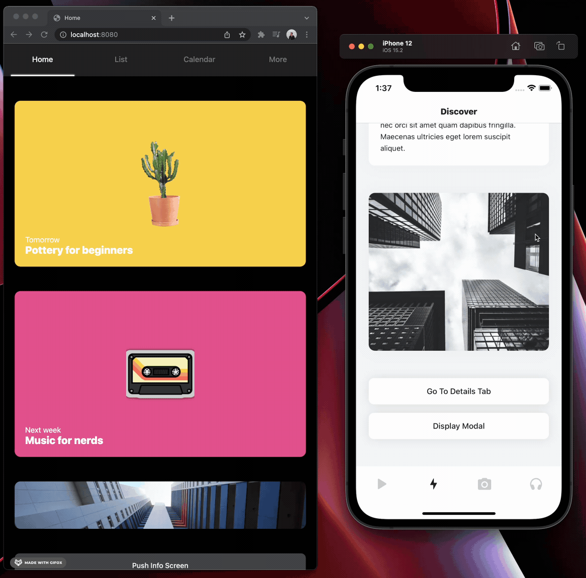

# React Native Boilerplate

A barebones, minimal React Native project with the following support:

- Support for iOS, Android & Web
- TypeScript
- Hermes for iOS & Android
- Reanimated 2.0
- React Navigation
- SVGs
- Github Actions

## FAQ

### Why not use Expo?
Expo is awesome, but as a native dev with experience in iOS and Android I often found myself fighting to keep my dependencies lean, and configurations easily accessible.

### Why use this boilerplate? There are a million others.
There are a ton of boilerplates for every tech stack under the sun. This boilerplate has a few unique features that I hadn't seen in others:
- Completely custom and readable babel, webpack, and metro configurations
- Native navigators for iOS and Android + web navigation intergration
- Typescript and SVG support preconfigured for all platforms

### How do I rename the project files to my app name?
You can rename this project to match yours using the `react-native-rename` package.
`npx react-native-rename <newName>`

### Are you accepting contributions?
I choosing to maintain and build on this package according to my preferences. If you have a suggestion of how something could be simpler or would like to help update a dependency, please feel free to create a PR.
